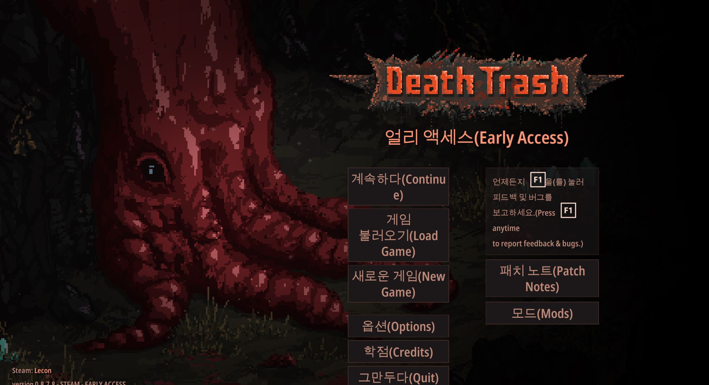
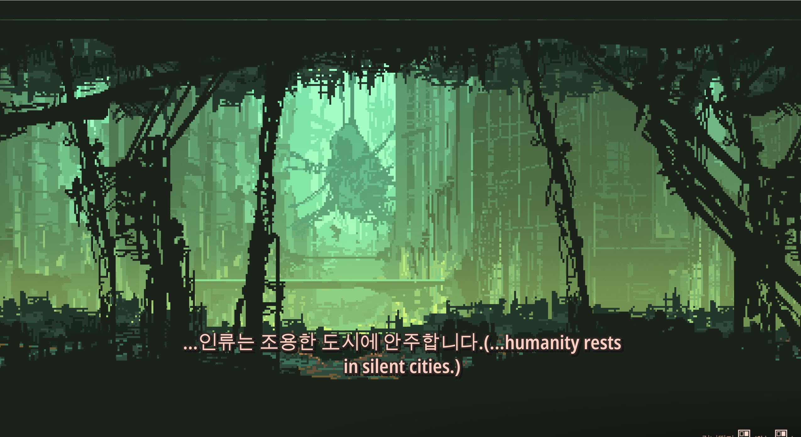
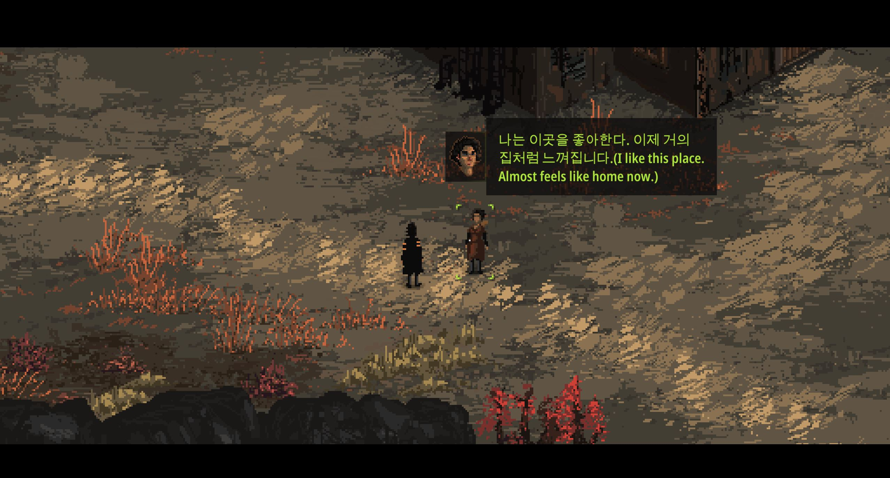

This code is an automatic translator with Google Translation API for [Death Trash](https://store.steampowered.com/app/941460/Death_Trash/).

The translation quality may be poor, but it is possible to play.

It may be useful for players with minority language and those who are beginning their localization.


## ScreenShot

The code was tested on 0.8.7.8.




  

## Installation

1. Install Python 3.x(tested on 3.10 but not crucial)

2. Run command to install required packages.

 ```

pip install jupyter pandas tqdm deep-translator

```

  

## Run

1. Get Death Trash script file(newLanguage.tsv) from https://store.steampowered.com/news/app/941460/view/2880604660323163236.

2. Move the script file to this directory.

3. In main.ipynb, change target lanaguage that you want to translate.

4. Run all cells in the notebook. It may take ~2 hours.

5. When finished, newLanguage_translated.tsv will be generated. With it, continue to follow instruction at https://docs.google.com/spreadsheets/d/1tFSY_w96tPz2e7Nh3Dfuoezc8cyBb8RuujaER5cHoE4